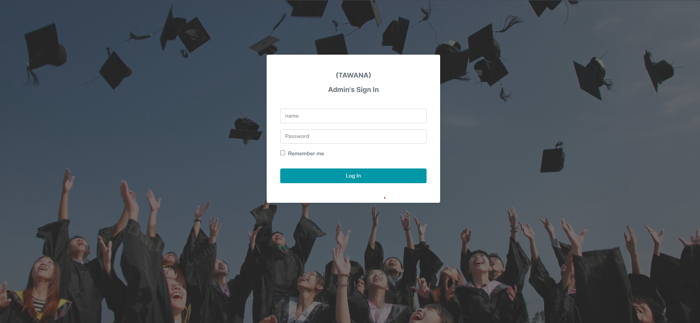
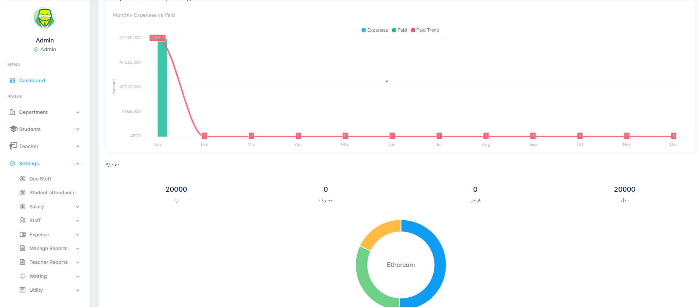
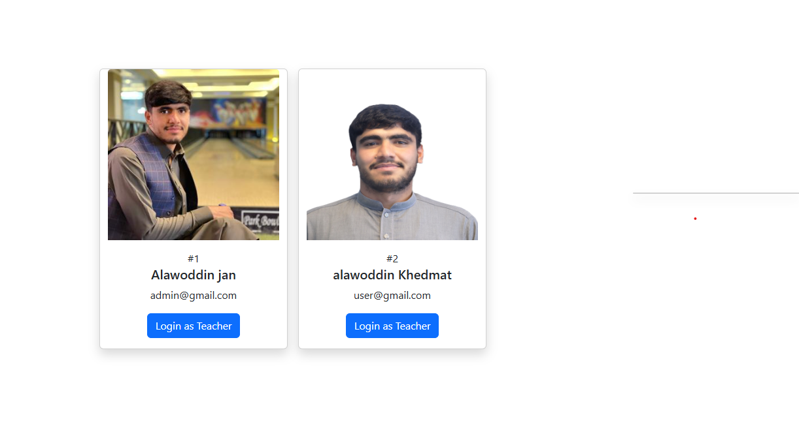
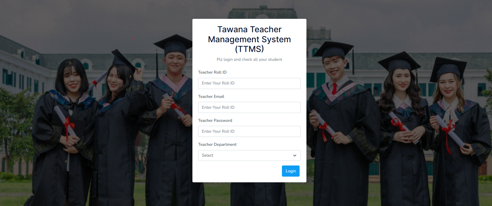
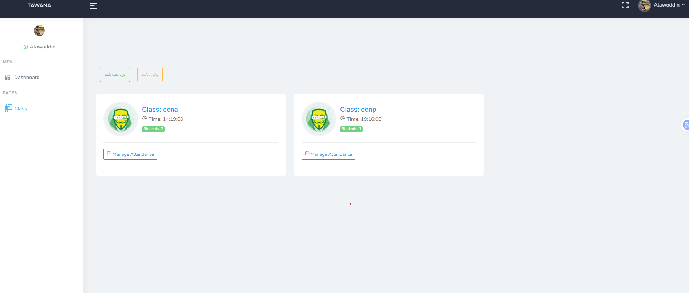
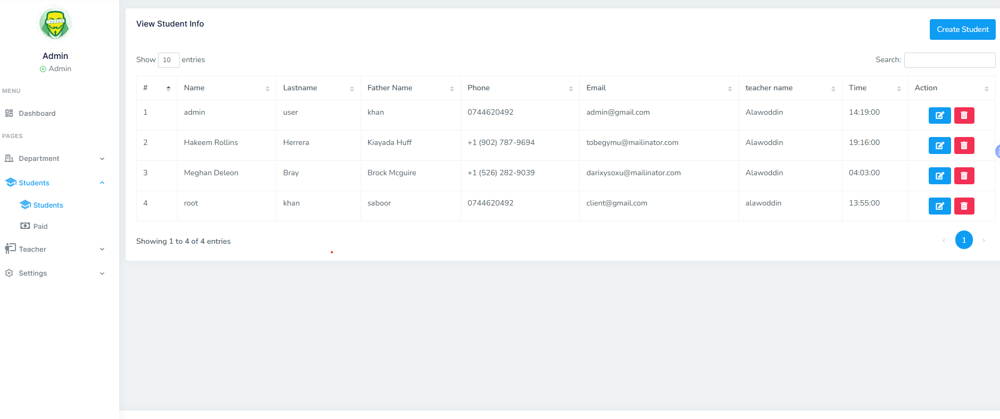
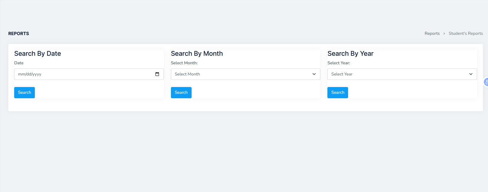

🎓 Student Management System
📌 Overview

Student Management System is a web-based application built with Laravel and MySQL designed to manage students, teachers, payments, and institutional operations efficiently.

The system provides separate dashboards for Admin and Teachers, enabling structured management of student records, attendance, salaries, and financial tracking.

This project reflects real-world educational management workflows with role-based access and reporting features.

✨ Key Features
👨‍💼 Admin Dashboard
👤 Register and manage students
💰 Track student payments and dues
👨‍🏫 Manage teachers and staff
📊 Generate reports (Monthly / 3 Months / Yearly)
💸 Expense management system
🔐 OTP-based authentication system
📈 Monitor financial activities
🔄 Assign students to teachers
👨‍🏫 Teacher Dashboard
📚 View assigned students
📝 Track student attendance
💵 Monitor salary information
📂 Access student-related data
📊 View class performance
⚡ Core Features
Role-Based Access Control (Admin / Teacher)
Student & Teacher Management System
Payment & Financial Tracking
Reporting System (Monthly / Yearly)
Secure Authentication (OTP System)
Clean and structured database design
🛠 Tech Stack
Backend: Laravel (PHP)
Frontend: Blade Templates
Database: MySQL
Authentication: Laravel Auth + OTP System
Version Control: Git & GitHub

## Screenshots

🔹 Admin Login

🔹 Admin OTP page

🔹 Admin OTP code

🔹 Admin Dashboard

🔹 Admin switch to teacher Dashboard

🔹 Teacher Login

🔹 Teacher Class & Attend

🔹 Student Management

🔹 Reports System

🔗 Live Demo

👉 http://127.0.0.1:8000/

⚙️ Installation
1️⃣ Clone the repository
git clone https://github.com/alawoddin/studentproject.git
cd student-management
2️⃣ Install dependencies
composer install
npm install
3️⃣ Setup environment
cp .env.example .env
php artisan key:generate
4️⃣ Configure database
DB_DATABASE=your_database
DB_USERNAME=root
DB_PASSWORD=
5️⃣ Run migrations
php artisan migrate
6️⃣ Run project
php artisan serve
npm run dev
🎯 Use Cases
Schools & educational institutes
Training centers
Private academies
Student and staff management systems
🚀 Future Improvements
Online payment integration
Notification system (SMS / Email)
Advanced analytics dashboard
Multi-branch support
👨‍💻 Author

Alawoddin Khedmat
Full-Stack Laravel Developer

🔗 GitHub: https://github.com/alawoddin

📄 License

This project is open-source and available under the MIT License.